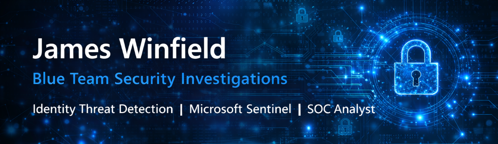

  

## Blue Team Security Analyst Portfolio

Cybersecurity professional specializing in identity threat detection, authentication monitoring, and security incident investigation within Microsoft cloud environments.

My projects demonstrate how security analysts detect suspicious authentication activity, investigate identity related alerts, analyze security logs, and implement remediation procedures in enterprise Microsoft environments.

---

## Core Technologies

       

---

# Featured Security Investigations

## Blue Team Security Investigation Project

[Enterprise Identity Incident Investigation](https://github.com/jwnfld3/enterprise-identity-incident-investigation)

This repository demonstrates how identity based security incidents can be detected, investigated, and remediated using Microsoft Sentinel, Microsoft Entra ID authentication logs, and the MITRE ATT&CK framework.

The project simulates the workflow used by Security Operations Center analysts when investigating suspicious authentication activity in enterprise Microsoft environments. It includes detection rules, authentication log analysis, investigation case files, MITRE ATT&CK technique mapping, and incident response playbooks.

Investigation scenarios were developed in a controlled lab environment designed to simulate enterprise authentication monitoring and identity security incidents.

## Detection Coverage

The investigation environment includes detection rules designed to identify identity based attacks within Microsoft Entra ID and Microsoft Sentinel logs.

| Attack Technique | Detection Rule |
|------------------|---------------|
| Password Spray | [Password Spray Detection](https://github.com/jwnfld3/enterprise-identity-incident-investigation/blob/main/detections/password-spray-detection.md) |
| Impossible Travel | [Impossible Travel Detection](https://github.com/jwnfld3/enterprise-identity-incident-investigation/blob/main/detections/impossible-travel-detection.md) |
| MFA Fatigue | [MFA Fatigue Detection](https://github.com/jwnfld3/enterprise-identity-incident-investigation/blob/main/detections/mfa-fatigue-detection.md) |
| Phishing Login | [Phishing Login Detection](https://github.com/jwnfld3/enterprise-identity-incident-investigation/blob/main/detections/phishing-login-detection.md) |
| Token Theft | [Token Theft Detection](https://github.com/jwnfld3/enterprise-identity-incident-investigation/blob/main/detections/token-theft-detection.md) |
| Data Exfiltration | [Data Exfiltration Detection](https://github.com/jwnfld3/enterprise-identity-incident-investigation/blob/main/detections/data-exfiltration-detection.md) |

---

### Azure Identity and Access Management Lab
Hands on lab demonstrating identity security concepts including role based access control, authentication monitoring, and access configuration within Microsoft environments.

https://github.com/jwnfld3/azure-access-mgmt

---

# Supporting Infrastructure Labs

These labs demonstrate the enterprise environments used to perform identity security investigations and authentication monitoring.

---

### Windows Virtualization and Security Lab
Virtualized Windows environment used to simulate authentication activity, monitor security logs, and practice investigation techniques within a lab environment.

https://github.com/jwnfld3/windows11-hyper-v

---

# Security Investigation Workflow

The projects in this portfolio demonstrate a structured Security Operations Center investigation process.

**Detection**  
Security monitoring tools identify suspicious authentication activity.

**Evidence Collection**  
Authentication logs and supporting artifacts are gathered for analysis.

**Investigation**  
Security analysts review authentication patterns and identify indicators of compromise.

**MITRE ATT&CK Mapping**  
Observed activity is mapped to attacker tactics and techniques.

**Remediation**  
Incident response playbooks are used to contain and resolve security events.

Workflow Summary

Detection → Evidence → Investigation → MITRE Mapping → Remediation

---

# Skills

Identity Security Investigation  
Authentication Log Analysis  
Microsoft 365 Administration  
Microsoft Entra ID Identity Management  
Incident Response Documentation  
Security Event Correlation  
Security Monitoring

---

# Additional Areas of Experience

Microsoft 365 administration  
Endpoint management using Microsoft Intune  
Active Directory administration  
Enterprise technical support  
Security documentation and investigation reporting

---

# Connect With Me

LinkedIn  
https://linkedin.com/in/james-winfield3

GitHub Repositories  
https://github.com/jwnfld3?tab=repositories

---

# Portfolio Overview

All projects in this portfolio were developed in controlled lab environments to simulate enterprise security investigations.

These projects demonstrate practical skills used by Security Operations Center analysts including authentication monitoring, identity investigation, log analysis, incident documentation, and remediation planning.

---

# Documentation Sources

The projects in this portfolio were developed through hands on practice and by referencing official vendor documentation and widely used cybersecurity frameworks.

### Microsoft Security Documentation

Microsoft Sentinel Documentation  
https://learn.microsoft.com/en-us/azure/sentinel/

Microsoft Entra ID Sign-in Log Documentation  
https://learn.microsoft.com/en-us/entra/identity/monitoring-health/concept-sign-ins

Microsoft Entra Conditional Access Documentation  
https://learn.microsoft.com/en-us/entra/identity/conditional-access/

Kusto Query Language Documentation  
https://learn.microsoft.com/en-us/azure/data-explorer/kusto/query/

### Security Frameworks

MITRE ATT&CK Framework  
https://attack.mitre.org/

MITRE ATT&CK Enterprise Matrix  
https://attack.mitre.org/matrices/enterprise/

### Additional Technical Resources

Microsoft 365 Security Documentation  
https://learn.microsoft.com/en-us/microsoft-365/security/

Azure Identity Protection Documentation  
https://learn.microsoft.com/en-us/entra/id-protection/

---

# Project Transparency

All projects in this portfolio were developed in controlled lab environments for educational and professional development purposes.

The scenarios simulate common identity security incidents that security analysts investigate in enterprise Microsoft cloud environments.
